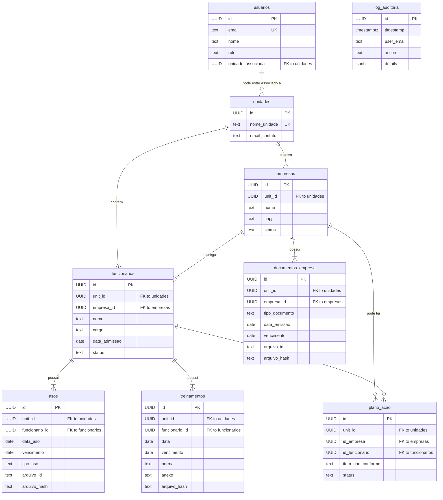

# 🗄️ Schema do Banco de Dados Supabase

## 1. Visão Geral

O banco de dados do SEGMA-SIS é implementado em **PostgreSQL 15** através do Supabase. A principal característica de design é a arquitetura **multi-tenant**, onde o isolamento de dados entre unidades operacionais é garantido por **Políticas de Row Level Security (RLS)** em todas as tabelas relevantes.

A chave primária `id` em todas as tabelas é do tipo `UUID` e gerada automaticamente, e a coluna `unit_id` serve como a chave de partição para o multi-tenancy.

## 2. Diagrama Entidade-Relacionamento (ERD)



## 3. Descrição Detalhada das Tabelas

### Tabelas Globais (Sem unit_id)

#### usuarios
Armazena as informações de login e permissão dos usuários do sistema.

```sql
CREATE TABLE public.usuarios (
    id UUID PRIMARY KEY DEFAULT gen_random_uuid(),
    email TEXT UNIQUE NOT NULL,
    nome TEXT NOT NULL,
    role TEXT NOT NULL CHECK (role IN ('admin', 'editor', 'viewer')),
    unidade_associada UUID REFERENCES public.unidades(id) ON DELETE SET NULL,
    created_at TIMESTAMPTZ DEFAULT NOW()
);
-- RLS: Habilitada. Admins veem todos, usuários veem apenas a si mesmos.
```

#### unidades
Tabela central que define cada tenant (unidade operacional).

```sql
CREATE TABLE public.unidades (
    id UUID PRIMARY KEY DEFAULT gen_random_uuid(),
    nome_unidade TEXT UNIQUE NOT NULL,
    email_contato TEXT,
    created_at TIMESTAMPTZ DEFAULT NOW()
);
-- RLS: Habilitada. Todos os usuários autenticados podem ler.
```

#### log_auditoria
Registra todas as ações importantes realizadas no sistema para fins de auditoria.

```sql
CREATE TABLE public.log_auditoria (
    id BIGINT PRIMARY KEY GENERATED ALWAYS AS IDENTITY,
    timestamp TIMESTAMPTZ DEFAULT NOW(),
    user_email TEXT,
    user_role TEXT,
    action TEXT NOT NULL,
    details JSONB,
    target_uo TEXT
);
-- RLS: Habilitada. Apenas admins podem ler.
```

### Tabelas por Unidade (Com unit_id e RLS)

A política de RLS para todas as tabelas abaixo garante que um usuário só pode acessar (SELECT, INSERT, UPDATE, DELETE) os registros cujo unit_id corresponde à sua unidade_associada. Administradores (role = 'admin') podem acessar os dados de todas as unidades.

#### empresas
Cadastro de empresas contratadas por unidade.

```sql
CREATE TABLE public.empresas (
    id UUID PRIMARY KEY DEFAULT gen_random_uuid(),
    unit_id UUID NOT NULL REFERENCES public.unidades(id) ON DELETE CASCADE,
    nome TEXT NOT NULL,
    cnpj TEXT,
    status TEXT DEFAULT 'Ativo' CHECK (status IN ('Ativo', 'Arquivado')),
    UNIQUE(unit_id, cnpj)
);
```

#### funcionarios
Cadastro de funcionários de cada empresa.

```sql
CREATE TABLE public.funcionarios (
    id UUID PRIMARY KEY DEFAULT gen_random_uuid(),
    unit_id UUID NOT NULL REFERENCES public.unidades(id) ON DELETE CASCADE,
    empresa_id UUID NOT NULL REFERENCES public.empresas(id) ON DELETE CASCADE,
    nome TEXT NOT NULL,
    cargo TEXT,
    data_admissao DATE,
    status TEXT DEFAULT 'Ativo' CHECK (status IN ('Ativo', 'Arquivado'))
);
```

#### asos
Registros de Atestados de Saúde Ocupacional.

```sql
CREATE TABLE public.asos (
    id UUID PRIMARY KEY DEFAULT gen_random_uuid(),
    unit_id UUID NOT NULL REFERENCES public.unidades(id) ON DELETE CASCADE,
    funcionario_id UUID NOT NULL REFERENCES public.funcionarios(id) ON DELETE CASCADE,
    data_aso DATE NOT NULL,
    vencimento DATE,
    tipo_aso TEXT NOT NULL,
    arquivo_id TEXT NOT NULL,  -- URL do Supabase Storage
    arquivo_hash TEXT
);
```

#### treinamentos
Registros de certificados de treinamento.

```sql
CREATE TABLE public.treinamentos (
    id UUID PRIMARY KEY DEFAULT gen_random_uuid(),
    unit_id UUID NOT NULL REFERENCES public.unidades(id) ON DELETE CASCADE,
    funcionario_id UUID NOT NULL REFERENCES public.funcionarios(id) ON DELETE CASCADE,
    data DATE NOT NULL,
    vencimento DATE NOT NULL,
    norma TEXT NOT NULL,
    anexo TEXT NOT NULL,  -- URL do Supabase Storage
    arquivo_hash TEXT,
    tipo_treinamento TEXT,
    carga_horaria INTEGER
);
```

#### documentos_empresa
Registros de documentos da empresa (PGR, PCMSO, etc.).

```sql
CREATE TABLE public.documentos_empresa (
    id UUID PRIMARY KEY DEFAULT gen_random_uuid(),
    unit_id UUID NOT NULL REFERENCES public.unidades(id) ON DELETE CASCADE,
    empresa_id UUID NOT NULL REFERENCES public.empresas(id) ON DELETE CASCADE,
    tipo_documento TEXT NOT NULL,
    data_emissao DATE NOT NULL,
    vencimento DATE NOT NULL,
    arquivo_id TEXT NOT NULL,
    arquivo_hash TEXT
);
```

#### plano_acao
Itens de não conformidade gerados pelas auditorias de IA.

```sql
CREATE TABLE public.plano_acao (
    id UUID PRIMARY KEY DEFAULT gen_random_uuid(),
    unit_id UUID NOT NULL REFERENCES public.unidades(id) ON DELETE CASCADE,
    id_empresa UUID NOT NULL REFERENCES public.empresas(id),
    id_documento_original TEXT,
    id_funcionario UUID REFERENCES public.funcionarios(id),
    item_nao_conforme TEXT NOT NULL,
    referencia_normativa TEXT,
    plano_de_acao TEXT,
    responsavel TEXT,
    prazo DATE,
    status TEXT DEFAULT 'Aberto',
    data_criacao DATE DEFAULT NOW(),
    data_conclusao DATE
);
```