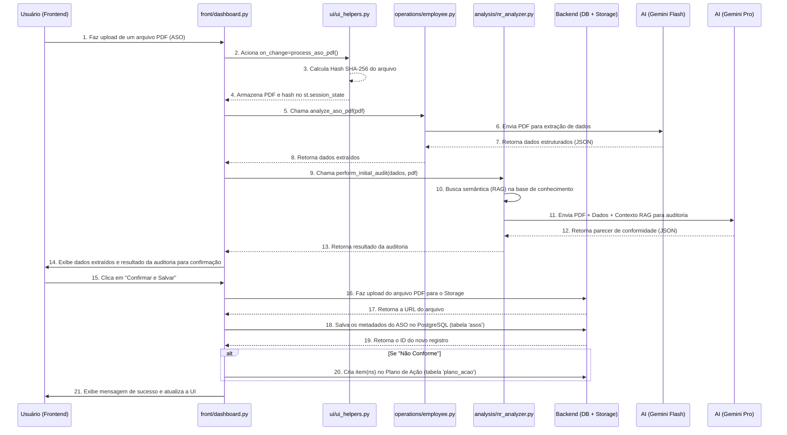

# 🌊 Diagrama de Fluxo de Dados

Este documento detalha os principais fluxos de dados do sistema SEGMA-SIS, com foco no processo de ponta a ponta de upload e análise de um documento.

## Fluxo Principal: Upload e Análise de Documento (ASO)

Este é o fluxo mais complexo e crítico do sistema. Ele combina interação do usuário, armazenamento de arquivos, múltiplas chamadas de IA e persistência de dados.

### Diagrama de Sequência

### Etapas Detalhadas

1. **Upload (Usuário)**
   - O usuário seleciona um arquivo PDF na interface do dashboard.py

2. **Callback on_change**
   - O componente st.file_uploader aciona imediatamente a função de callback process_aso_pdf

3. **Cálculo de Hash**
   - Calcula o hash SHA-256 do arquivo para futura detecção de duplicatas

4. **Armazenamento em Sessão**
   - O objeto do arquivo e seu hash são armazenados no st.session_state

5. **Extração com IA (Flash)**
   - A classe EmployeeManager utiliza o Gemini 1.5 Flash para análise rápida
   - Extrai informações básicas como datas, nomes e tipo de ASO

6. **Auditoria com IA (Pro + RAG)**
   - A classe NRAnalyzer realiza:
     - Busca semântica na base de conhecimento local
     - Monta prompt com documento, dados extraídos e contexto RAG
     - Envia ao Gemini 1.5 Pro para auditoria de conformidade

7. **Confirmação do Usuário**
   - Interface exibe resultados da extração e auditoria
   - Aguarda validação humana das informações

8. **Persistência**
   - Upload do PDF para Supabase Storage
   - Salvamento dos metadados no PostgreSQL
   - Criação condicional de plano de ação (se não conforme)

## Fluxo de Autenticação

1. **Acesso Inicial**
   - Usuário acessa a URL
   - Segsisone.py verifica is_user_logged_in()

2. **Redirecionamento**
   - Se não logado, exibe botão de login Google
   - Redireciona para autenticação OIDC

3. **Callback e Autorização**
   - Retorno pós-login Google
   - authenticate_user() verifica permissões
   - Carrega role e unit_id na sessão

4. **Carregamento de Dados**
   - Inicialização dos managers com unit_id
   - Aplicação de políticas RLS
   - Renderização da página solicitada