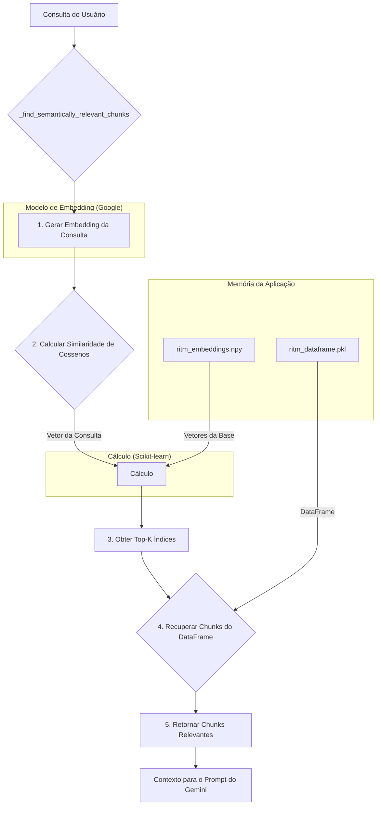

# 🤖 Sistema RITM (Retrieval-Inference-Text Merge)

## 1. O Que é RITM e Por Que Usamos?

**RITM (Retrieval-Inference-Text Merge)** é uma técnica avançada de IA que aprimora a capacidade de um Grande Modelo de Linguagem (LLM), como o Gemini, de responder a perguntas.

-   **Problema:** Um LLM padrão, mesmo que poderoso, possui um conhecimento "congelado" no tempo (sua data de treinamento) e pode não ter acesso a informações muito específicas, como os detalhes exatos de uma Norma Regulamentadora (NR) brasileira. Isso pode levar a respostas genéricas ou imprecisas ("alucinações").

-   **Solução RITM:** Em vez de apenas perguntar ao modelo, o sistema RITM primeiro **busca (Retrieval)** informações relevantes em uma base de conhecimento privada e confiável. Em seguida, ele realiza **inferência (Inference)** sobre o contexto encontrado, e finalmente executa a **mesclagem de texto (Text Merge)** para gerar uma resposta coerente.

No SEGMA-SIS, o RITM é a tecnologia que transforma o Gemini Pro de um modelo genérico em um **especialista em auditoria de SST**, capaz de citar itens normativos específicos ao analisar um documento.

## 2. Componentes do Sistema RITM

O nosso sistema RITM, implementado em `analysis/nr_analyzer.py`, é composto por dois elementos principais que são pré-processados e carregados na memória.

#### `ritm_dataframe.pkl`
-   **O que é:** Um arquivo [Pandas DataFrame](https://pandas.pydata.org/docs/reference/api/pandas.DataFrame.html) serializado (salvo em disco) que contém a base de conhecimento textual.
-   **Estrutura:** Cada linha representa um "chunk" (pedaço) de texto de uma NR.
    -   `Source`: O nome do documento original (ex: "NR-01.pdf").
    -   `Answer_Chunk`: O texto do pedaço da norma.
    -   Outros metadados.
-   **Como foi criado:** Documentos PDF das principais NRs foram divididos em pedaços de texto lógicos e sobrepostos para não perder o contexto entre eles.

#### `ritm_embeddings.npy`
-   **O que é:** Um arquivo NumPy array contendo os "embeddings" (vetores numéricos) de cada `Answer_Chunk` do dataframe.
-   **O que são Embeddings:** São representações matemáticas do significado semântico de um texto. Textos com significados semelhantes terão vetores numericamente próximos no espaço multidimensional.
-   **Como foi criado:** Cada `Answer_Chunk` foi processado pelo modelo de embedding do Google (`models/text-embedding-004`), que converteu o texto em um vetor de alta dimensão (ex: 768 números). Este array tem a mesma quantidade de linhas que o `ritm_dataframe.pkl`.

## 3. Fluxo de Funcionamento da Busca Semântica

Quando uma auditoria é solicitada (ex: `perform_initial_audit` em `nr_analyzer.py`), o seguinte fluxo ocorre:

## 4. Otimização e Cache

- **Pré-processamento:** A geração dos embeddings da base de conhecimento é um processo lento e caro. Por isso, ele é feito offline e os resultados (ritm_embeddings.npy) são salvos para serem apenas carregados pela aplicação.
- **Cache em Memória:** Os arquivos ritm_dataframe.pkl e ritm_embeddings.npy são carregados na memória apenas uma vez quando a aplicação inicia, e são mantidos em cache (@st.cache_data(ttl=3600)) para evitar leituras repetidas do disco.
